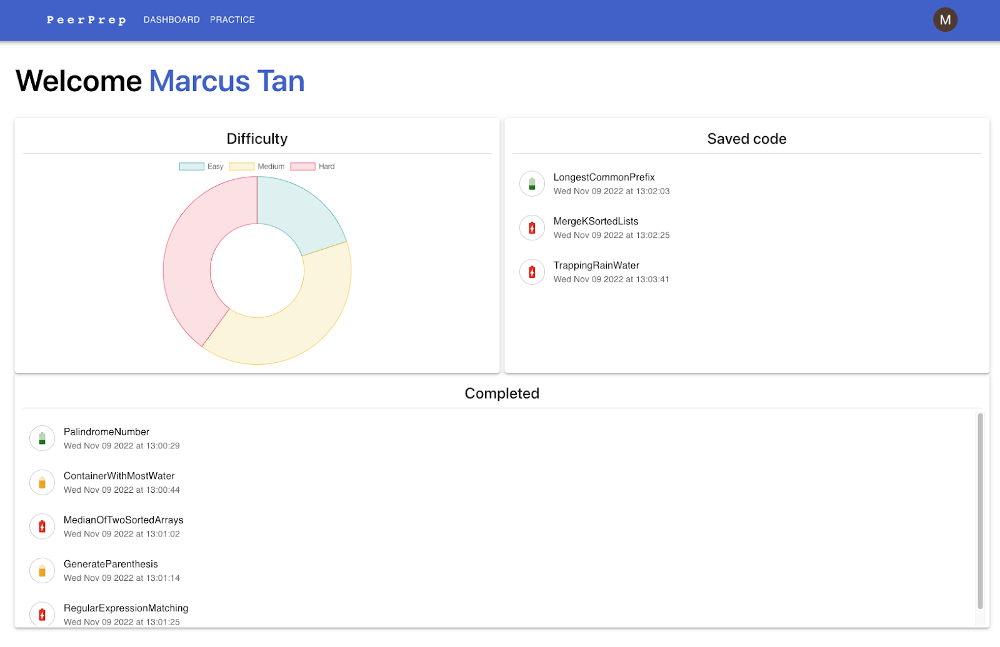
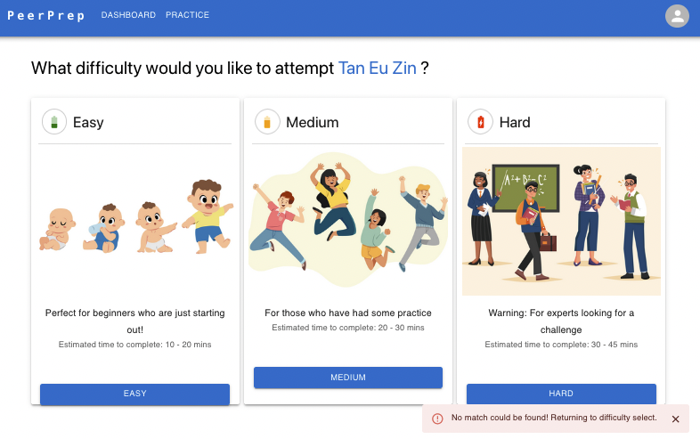
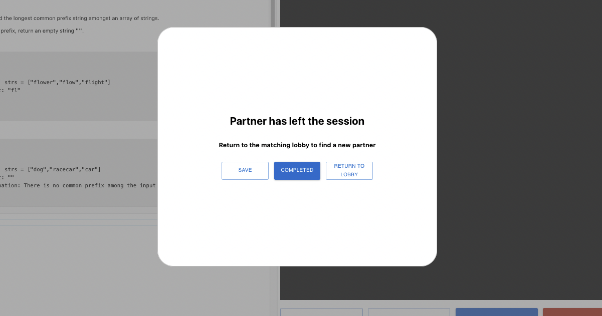
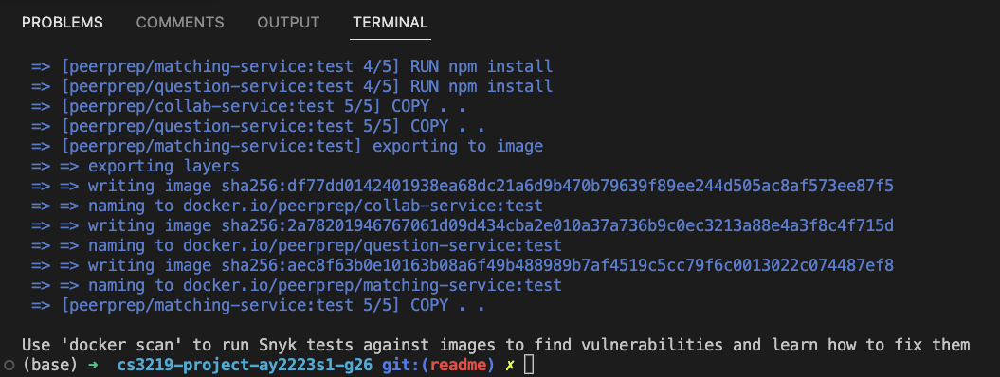
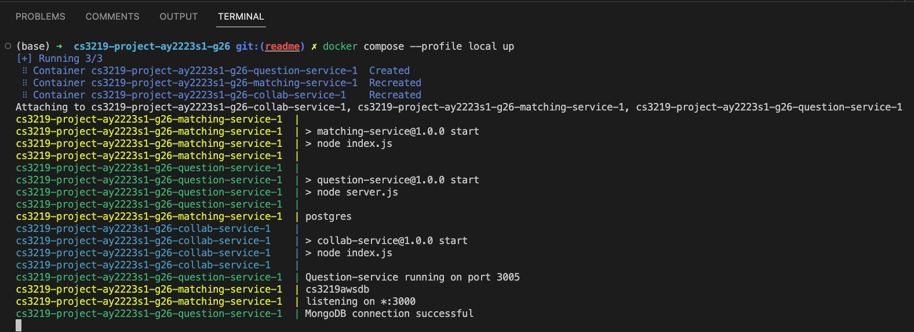
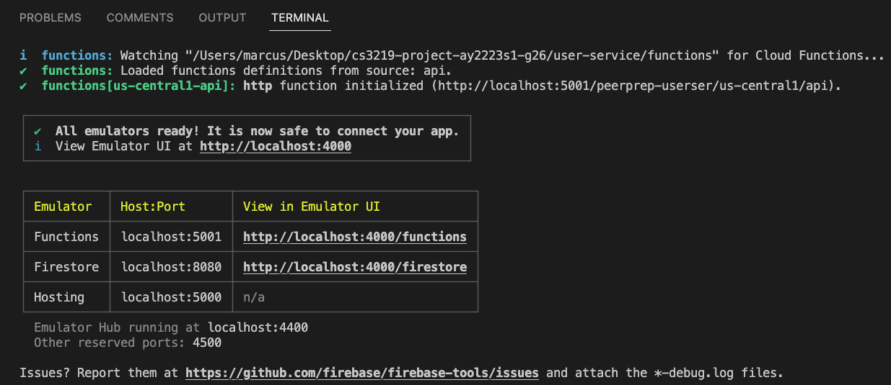
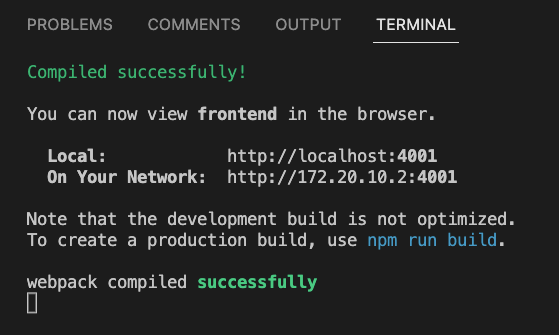
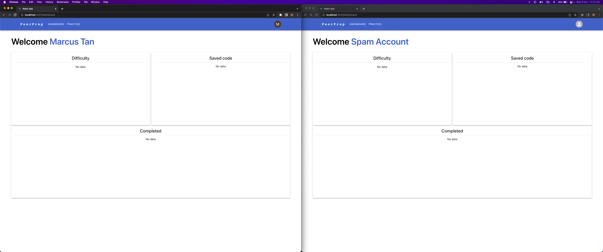

# PeerPrep for CS3219-AY22-23 G26
PeerPrep is a code challenge platform that allows it's users an opportunity to connect and collaborate with other like-minded programmers to solve classic Leetcode problems. 

This process is done through a matching system to match users, connecting them via WebSockets and enabling them to work with one another using a collaborative code editor.

## Project Showcase
The following showcase displays some screenshots of the production application in action, after deployment to AWS.

### Dashboard

### Matching

## Leaving a Matched Instance

## Project Requirements
More on the project requirements and a specification document of what has been implemented can be found under the /docs portion of this repository.

## Setup

**Note: Even after running this setup, you will not have the ability to run the application as production endpoints such as databases deployed on AWS have been taken down to prevent accumulating costs**

Prerequisites
1. Have Docker Desktop installed on your machine
2. Ensure Docker Daemon is running (Docker Desktop is open)
3. Have Node.js 18 and above installed on your machine
4. Have npm installed on your machine
5. Install firebase tools on your machine using `npm install -g firebase-tools`
6. Unzip `secrets.zip` and place `.env` files in root folder of each microservice. For example, the `.env` file in the secrets/user-service folder goes into the user-service folder in this project

## Instructions to run app locally with localhost endpoints

In root directory of the project
1. Run `docker compose --profile local build` 
2. Run `docker compose --profile local up` 

### User Service
1. In another terminal, Change directory to user-service directory using `cd user-service`
2. Install npm packages using `npm i`
3. Change directory to user-service/functions directory using `cd functions`
4. Install npm packages using `npm i`
5. Go back to user-service directory using `cd ..`
6. Run the user-service using `npm run firebase` 

### Frontend
1. In another terminal, change directory to frontend directory using `cd frontend`
2. Install npm packages using `npm i`
3. Run first instance of the app locally using `npm run devuser1` 
4. Run second instance of the app locally using `npm run devuser2`
5. In your web browser, two separate tabs should be open
6. Sign in with two different Google accounts for testing 

## Instructions to run app locally with HTTPS endpoints (production)

### Frontend
1. In another terminal, change directory to frontend directory using `cd frontend`
2. Install npm packages using `npm i`
3. Run first instance of the app locally using `npm run produser1` 
4. Run second instance of the app locally using `npm run produser2`
5. In your web browser, two separate tabs should be open
6. Sign in with two different Google accounts for testing 
